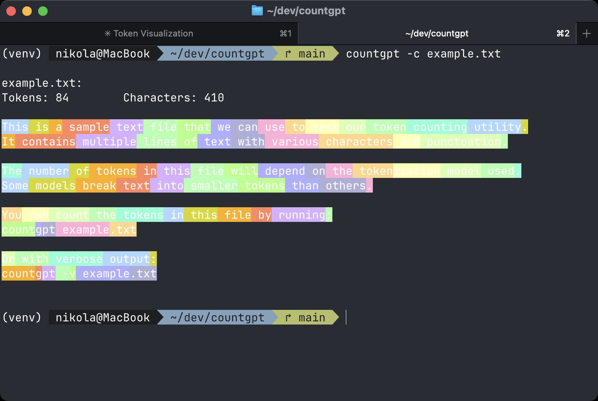
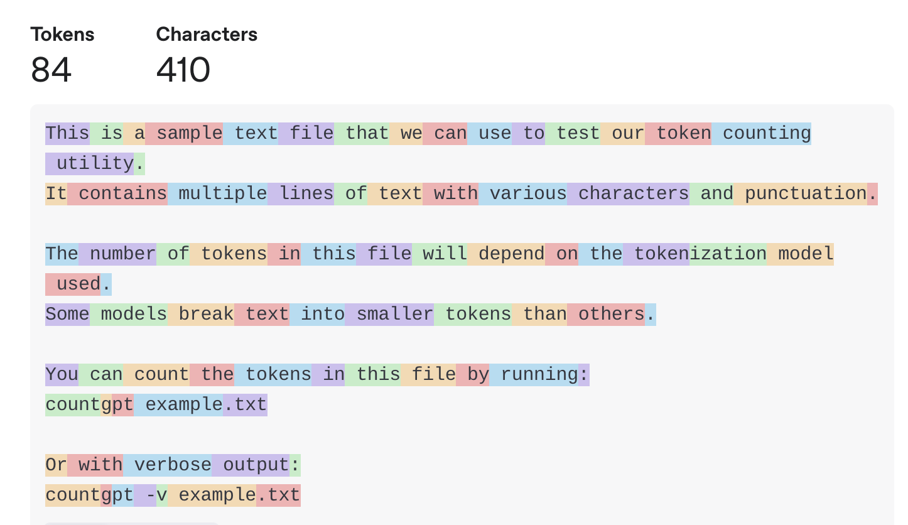

# CountGPT

<p align="center">
  
</p>

A simple command-line utility to count tokens in text files or from piped input.

## What are tokens?

Tokens are pieces of text that language models like GPT process. They can be as short as a single character or as long as a word. For example, "tokenization" might be split into "token" and "ization" as two separate tokens. The number of tokens affects processing time and cost when using AI models.

## Installation

There are several ways to install CountGPT:

### Install from GitHub (Recommended)

```bash
# Install directly from GitHub
pip install git+https://github.com/nkkko/countgpt.git
```

### Clone and Install

```bash
# Clone the repository
git clone https://github.com/nkkko/countgpt.git
cd countgpt

# Install in regular mode
pip install .

# Or install in development mode
pip install -e .
```

### Using the included installation script

```bash
# Clone the repository
git clone https://github.com/nkkko/countgpt.git
cd countgpt

# Run the installation script (creates a virtual environment)
chmod +x install_dev.sh
./install_dev.sh

# Activate the virtual environment
source venv/bin/activate
```

After installation, you can verify that the tool is working correctly:

```bash
# Check the installed version
countgpt --list-models
```

## Basic Usage

Count tokens in a single file:
```bash
countgpt file.txt
```

Count tokens in multiple files:
```bash
countgpt file1.txt file2.md document.pdf
```

Pipe text directly to countgpt:
```bash
echo "Hello, world!" | countgpt
cat file.txt | countgpt
```

Get detailed information with verbose mode:
```bash
countgpt -v file.txt
```

Visualize tokens with colorful highlighting:
```bash
countgpt -c file.txt
```

## Examples

Basic token count:
```bash
$ countgpt example.txt
example.txt: 68
```

<p align="center">
  
</p>

Verbose output:
```bash
$ countgpt -v example.txt
example.txt:
  Model: cl100k_base
  Token count: 68
  Character count: 374
```

Counting from piped input:
```bash
$ echo "How many tokens is this?" | countgpt
4
```

Colorful token visualization:
```bash
$ countgpt -c example.txt
```

<p align="center">
  
</p>

This visualization mode helps you see exactly how your text is tokenized by the model.

## Available Models

CountGPT uses the tiktoken library to count tokens. You can use either:

1. A specific tokenizer model name (like `cl100k_base`)
2. An actual LLM model name (like `gpt-4`, `gpt-3.5-turbo`)

```bash
# Using a tokenizer model name
countgpt --model cl100k_base file.txt

# Using an LLM model name
countgpt --model gpt-4 file.txt
```

To see all available models:
```bash
countgpt --list-models
```

### Base Tiktoken Models

- `cl100k_base` - Used by ChatGPT and newer models (default)
- `p50k_base` - Used by GPT-3.5-Turbo and text-davinci-003
- `p50k_edit` - Used by text-davinci-edit-001
- `r50k_base` - Used by davinci and older models
- `gpt2` - Used by GPT-2 models
- `o200k_base` - Used by Claude models and GPT-4o

### Supported LLM Models

CountGPT supports **50+ LLM model names** including:

**Anthropic Models:**
- `claude-3-opus`, `claude-3-sonnet`, `claude-3-haiku`
- `claude-2`, `claude-2.0`, `claude-2.1`
- `claude-instant`, `claude` (shorthand)

**OpenAI Models:**
- `gpt-4o`, `gpt-4-turbo`, `gpt-4` (and variants)
- `gpt-3.5-turbo`, `gpt-3.5` (and variants)
- `chatgpt` (shorthand)
- `text-embedding-3-small`, `text-embedding-3-large`

**Simple Shorthands:**
- `4o` (for GPT-4o)
- `4` (for GPT-4)
- `3.5` (for GPT-3.5-Turbo)
- `opus`, `sonnet`, `haiku` (for Claude models)
- `claude` (for any Claude model)

**Deprecated Models:**
- `text-davinci-003`, `text-davinci-002`, etc.
- `davinci`, `curie`, `babbage`, `ada`
- Various code and embedding models

To see a complete list of all supported models:
```bash
countgpt --list-models
```

You can simply use the model name you're using with the API:

```bash
$ countgpt --model gpt-4 example.txt
example.txt: 68

$ countgpt --model gpt-3.5-turbo example.txt
example.txt: 68

$ countgpt --model gpt2 example.txt
example.txt: 76
```

## Full Command Options

```bash
$ countgpt --help
Usage: countgpt [OPTIONS] [FILES]...

  Count tokens in text files or from standard input.

  You can specify either a tiktoken encoding model (like cl100k_base) or an
  actual LLM model name (like gpt-4, gpt-3.5-turbo) to count tokens.

  EXAMPLES:
      countgpt file.txt
      countgpt file1.txt file2.md
      countgpt --model gpt-4 file.txt
      countgpt -c file.txt           # Visualize tokens with colors
      cat file.txt | countgpt
      echo "Hello world" | countgpt

Options:
  -m, --model TEXT  Tokenizer model or LLM model name. Default: cl100k_base
  -v, --verbose     Show detailed information
  -l, --list-models List all supported models and exit
  -c, --visualize   Visualize tokens with colorful output
  --help            Show this message and exit
```

## Why Count Tokens?

- **Cost estimation**: When using AI services, you pay per token
- **Input limit management**: AI models have maximum token limits
- **Performance optimization**: Processing fewer tokens is faster

## Contributing

Contributions are welcome! Feel free to open issues or submit pull requests.

## License

MIT